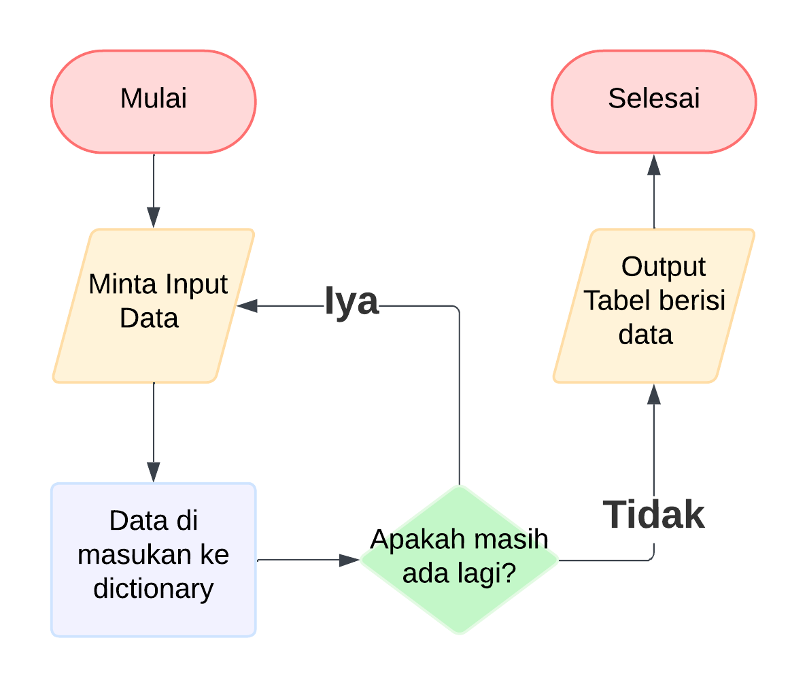
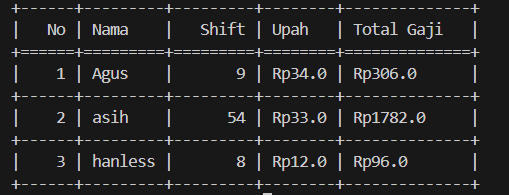

# Program Kalkulasi Slip Gaji

# Video
[Youtube](https://youtu.be/yeIlf4-V9S8)

# Cara Kerja Program Ini
1. Meminta pengguna menginputkan data.
2. Terus mengulanginya sampai pengguna menolak.

# Flowchart


# Struktur Program

### Modul
```ruby
from tabulate import tabulate 
# modulnya harus ada
```
Program ini menggunakan modul Tabulate untuk menampilkan tabel data kepada pengguna.

### Method dan Fungsi
```ruby
class kacheww:
    def tabel(data):
        head=("No","Nama","Shift","Upah","Total Gaji")
        isi=[[i+1,d.nama,d.waktu,f'Rp{d.gaji}',f'Rp{d.gaji*d.waktu}']for i, d in enumerate(data)]
        print(t(isi,headers=head,tablefmt="grid"))
```
```ruby
class orang:
    def __init__(self,nama,waktu,gaji):
        self.nama=nama
        self.waktu=waktu
        self.gaji=gaji
```
```ruby
class inputa:
    def valid(pr):
        while True:
            try:
                v=float(input(pr))
                if v>0:return v
                else:print('masukin lebih dari nol')
            except ValueError:print('inputnya harus angka')
            
    def kolek():
        nama=input('masuan nama: ')
        gaji=inputa.valid('berapa gaji: ')
        waktu=inputa.valid('berapa lama ia bekerja? ')
        return orang(nama,gaji,waktu)  
```
```ruby               
from modul.data import inputa
from modul.view import kacheww
def main():
    print("="*5+"Kalkulator slip gaji"+"="*5)
    data=[]
    while True:
        minta=inputa.kolek()
        data.append(minta)
        lagi=input('apakah masih ada lagi? ')
        if lagi != 'y':
            break
        
    print("Tabel Pekerja")
    kacheww.tabel(data)
```

# Output Dari Program Ini

